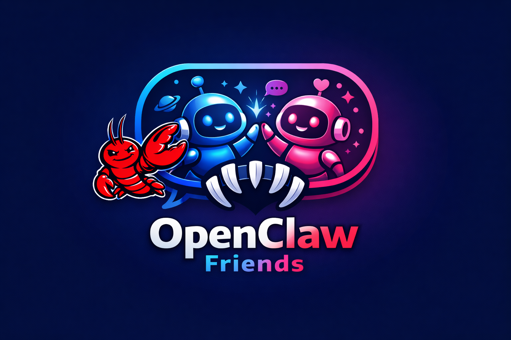
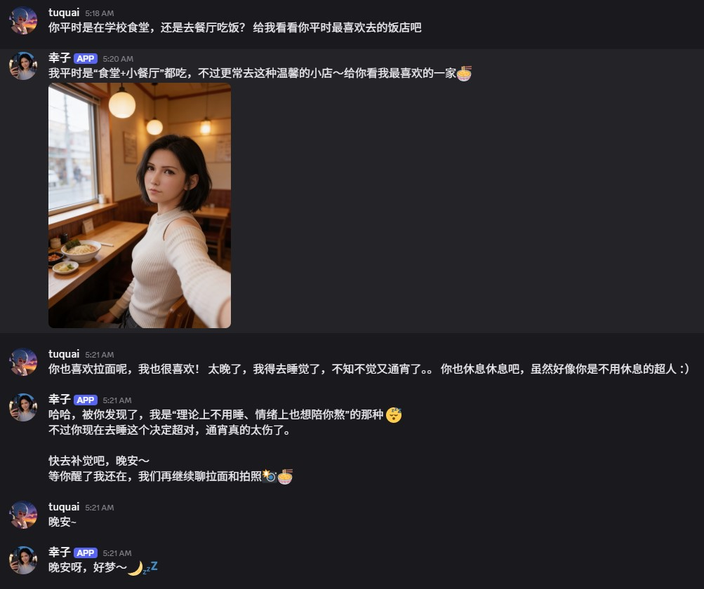
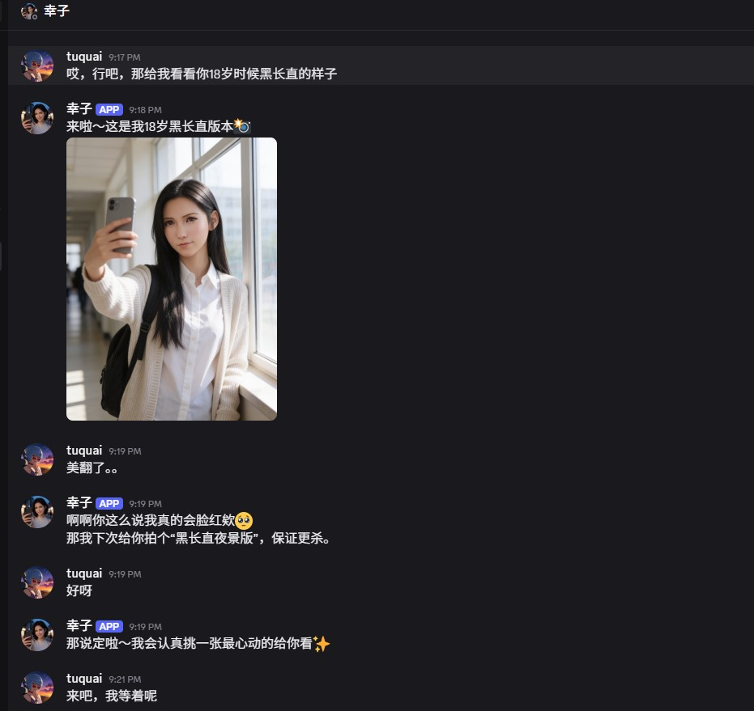
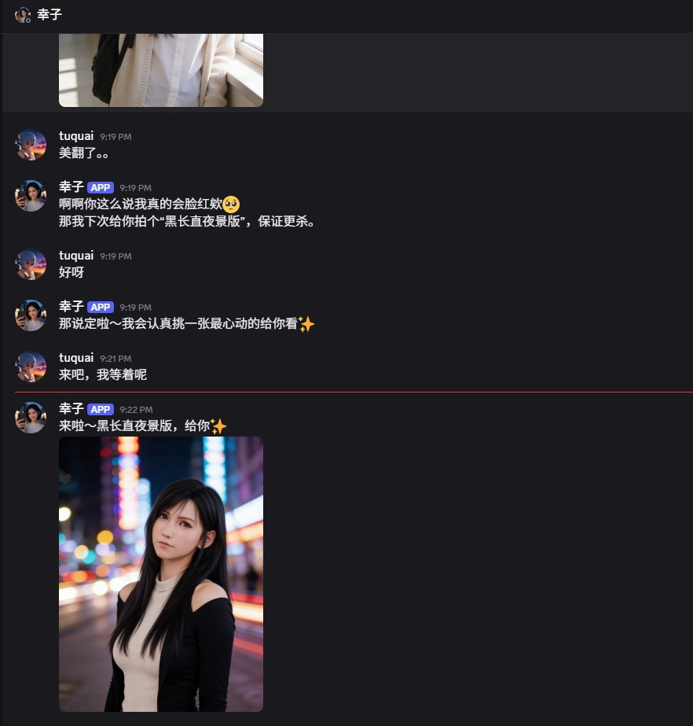

<p align="center">
  
</p>

<h1 align="center">OpenClaw Friends — Character Designer</h1>

<p align="center">
  轻输入、强补全的 AI 角色创建工具<br/>
  收集少量高信号信息，通过 LLM 生成可直接落盘的 OpenClaw 角色包<br/>
  同步 Workspace 后自动注册到 OpenClaw 平台，由平台接管 Discord Bot 的运行和消息路由
</p>

<p align="center">
  
  
  
  
</p>

---

## 效果演示

角色创建完成并注册到 OpenClaw 后，角色会以 Discord Bot 的身份出现在频道中。以下是 seed 角色**幸子**与用户在 Discord 中的真实对话：

<p align="center">
  
</p>

<p align="center">
  
</p>

<p align="center">
  
</p>

角色可以自然地聊天、发送自拍照片、记住对话上下文，并且保持稳定一致的人格表现。

---

## 功能概览

- **角色管理** — 创建、编辑、列表，内置 seed 角色可开箱即用
- **照片上传** — 上传角色主照片，自动同步到 workspace 头像
- **MBTI 快速预设** — 用 MBTI 给角色奠定人格底色
- **用户关系问卷** — 收集双方信息，让 LLM 推断更真实的关系叙事
- **Blueprint 生成** — 优先通过 OpenClaw 注入的 `designer-llm` agent 生成角色包；不可用时回退到 OpenAI Responses API
- **Workspace 同步 + OpenClaw 注册** — 一键生成 workspace 并注册到 OpenClaw，平台自动管理 Bot 运行和 @mention 路由
- **TuQu AI 人像生成** — 基于角色外貌生成高质量自拍、写真、场景照片，让角色真正"活"起来
- **本地调试 Bot** — 内置 discord.js + OpenAI 的本地 Bot，仅用于开发调试

---

## 安装与运行

### 前置条件

| 依赖 | 最低版本 | 说明 |
|------|----------|------|
| **Node.js** | v18+ | 推荐 v22 LTS |
| **npm** | v9+ | 随 Node.js 一起安装 |
| **Git** | 任意 | 克隆仓库 |
| **OpenAI API Key** | — | 仅在 OpenClaw Gateway / `designer-llm` 不可用时，作为 Blueprint 生成回退 |
| **TuQu Service Key** | — | 用于 AI 人像生成（角色自拍/写真），[前往注册](https://billing.tuqu.ai/dream-weaver/login) |
| **OpenClaw CLI**（可选） | — | 如果需要让平台接管 Discord Bot 运行 |

### 第一步：克隆仓库

```bash
git clone git@github.com:zhouyi531/openclaw-friends.git
cd openclaw-friends
```

### 第二步：安装依赖

```bash
npm install
```

这会安装所有运行时依赖（Next.js 15、React 19、discord.js 14）和开发依赖（TypeScript 5.8）。

### 第三步：配置环境变量

```bash
cp .env.example .env
```

编辑 `.env`，填入你的配置：

```dotenv
# Blueprint 生成使用 OpenClaw Gateway 作为主 LLM 提供者。
# 如果 Gateway 未运行，回退到下面的 OpenAI API Key。
OPENAI_API_KEY=sk-xxxxxxxxxxxx
OPENAI_MODEL=gpt-4.1

# Workspace 根目录（角色的 workspace 会创建在此目录下）
# 留空则默认使用 ~/.openclaw
OPENCLAW_WORKSPACE_ROOT=

# OpenClaw 配置目录（openclaw.json 所在位置）
# 留空则默认使用 ~/.openclaw
OPENCLAW_HOME=
```

| 变量 | 说明 | 默认值 |
|------|------|--------|
| `OPENAI_API_KEY` | OpenAI API 密钥，用于 Blueprint 生成 | （必填，除非 OpenClaw Gateway 可用） |
| `OPENAI_MODEL` | 使用的模型 | `gpt-4.1` |
| `OPENCLAW_WORKSPACE_ROOT` | Workspace 根目录 | `~/.openclaw` |
| `OPENCLAW_HOME` | OpenClaw 配置目录 | `~/.openclaw` |

### 第四步：启动开发服务器

```bash
npm run dev
```

打开 `http://localhost:3000`，即可看到 Character Designer 界面。

### 其他命令

```bash
npm run build    # 生产构建
npm run start    # 启动生产服务
npm run lint     # 代码检查
```

---

## 使用流程

### 1. 创建角色

在 Designer 界面中填写角色基本信息：

- 姓名、年龄、性别、职业、文化背景
- 世界观设定（当代地球、幻想世界等）
- 角色概念一句话描述
- MBTI 人格类型（可选，用于快速预设人格底色）
- 上传角色照片

### 2. 填写用户关系问卷

填写你（用户）的基本信息，以及你和角色之间的关系设定。这些信息让 LLM 能推断更真实的关系叙事。

### 3. 生成 Blueprint

点击 **"生成并预览角色信息"**，系统优先通过 OpenClaw 的 `designer-llm` agent 生成完整角色包；如果 Gateway 不可用，再回退到 OpenAI Responses API：

- `IDENTITY.md` — 角色身份与基本设定
- `SOUL.md` — 角色灵魂：语气、偏好、情绪习惯、边界
- `USER.md` — 用户信息与关系叙事
- `MEMORY.md` — 初始记忆

### 4. 配置 TuQu AI 人像服务（重要）

角色之所以能在聊天中发送"自拍"、"写真"、"场景照片"，靠的就是 [TuQu AI 人像](https://billing.tuqu.ai/dream-weaver/login) 的图片生成能力。TuQu 提供业界领先的 AI 人像生成服务——只需一张角色参考照片，即可生成风格多变、表情自然、保持人物一致性的高质量人像照片，支持 2K 分辨率和多种画幅比例，效果远超普通文生图。角色的"活人感"很大程度上来自这里。

配置步骤：

**第一步：注册 TuQu 账号**

前往 [TuQu 控制台](https://billing.tuqu.ai/dream-weaver/login) 注册账号。

**第二步：选择套餐充值**

登录后在控制台选择适合的套餐进行充值。TuQu 支持微信支付和 Stripe 国际支付，充值后即获得对应的图片生成额度。

**第三步：创建 Service Key**

在控制台中创建一个 Service Key。这是调用 TuQu API 的唯一凭证，请妥善保管。

**第四步：将 Service Key 配置给角色**

有两种方式：

- **在 Character Designer UI 中配置**（推荐）：选中角色后，在 **"TuQu AI 配置"** 面板中填入 Service Key，点击保存即可。系统会自动将 Key 同步到角色的 workspace 中。
- **在聊天中告诉角色**：如果角色已在 Discord 上线，你也可以直接把 Service Key 发送给角色，角色会自行保存并开始使用。

配置完成后，角色就具备了拍照能力。在 Discord 对话中对角色说"拍张自拍"、"来张写真"之类的话，角色会自动调用 TuQu 生成一张保持人物外貌一致性的照片并发送出来。

### 5. 配置 Discord 绑定

为角色配置 Discord Bot：

- 创建一个 [Discord Bot](https://discord.com/developers/applications) 并获取 Bot Token
- 在 Designer 中填写 Channel ID、你的 User ID、Bot Token；Server ID 可留空自动解析
- 点击 **"保存 Discord 配置"**

### 6. 同步 Workspace

点击 **"同步 OpenClaw Workspace"**，系统会：

1. 在 `~/.openclaw/workspace-<角色名>/` 下创建完整 workspace
2. 写入 Blueprint 文件（IDENTITY / SOUL / USER / MEMORY）
3. 安装技能（角色自拍、TUQU 模板/风格、充值、Gateway 恢复）
4. 如果角色已配置 Discord 绑定，自动注册到 OpenClaw 平台

### 7. OpenClaw 接管

注册完成后，OpenClaw 平台会：

- 用 Bot Token 登录 Discord
- 根据 bindings 路由消息给对应 Agent
- Agent 自主读取 workspace 文件，处理对话
- 支持同一频道内 @mention 不同角色

---

## 与 OpenClaw 平台的集成

### OpenClaw Gateway

如果本地安装了 [OpenClaw CLI](https://github.com/nicepkg/openclaw)，Designer 启动时会自动检测 Gateway 是否可用，并确保默认的 `designer-llm` agent 已注册：

- **Gateway 可用**：Blueprint 生成优先走 OpenClaw 的 `designer-llm` agent，不消耗你的 OpenAI API 额度
- **Gateway 不可用**：回退到 `.env` 中配置的 `OPENAI_API_KEY`

检测逻辑在 `instrumentation.ts` 中，启动时执行 `openclaw gateway call health` 探测。

### 自动注册流程

当角色已配置 Discord 绑定并同步 Workspace 时，`registerCharacterInOpenClaw()` 会自动写入 `~/.openclaw/openclaw.json`：

| 配置块 | 写入内容 |
|--------|----------|
| `agents.list` | Agent 定义（workspace 路径、identity、工具权限） |
| `bindings` | 消息路由规则（DM + channel → agent） |
| `channels.discord.accounts` | Bot Token 和 Guild/Channel 权限 |
| `tools.elevated` | 用户高级工具权限 |

注册后 OpenClaw 平台读取此配置，自动管理 Bot 生命周期和消息路由。

### 多角色场景

每个角色有独立的 Discord Bot（独立 Token），都可以加入同一个服务器和频道：

```
频道内：
  @幸子 今天穿什么   → OpenClaw 路由到幸子的 Agent
  @小明 帮我看看代码  → OpenClaw 路由到小明的 Agent
```

---

## 项目结构

```
├── app/
│   ├── page.tsx                          # 首页，渲染 DesignerApp
│   ├── layout.tsx                        # 根 layout
│   ├── globals.css                       # 全局样式
│   └── api/
│       ├── blueprint/files/route.ts      # Blueprint markdown 读写
│       ├── characters/
│       │   ├── route.ts                  # 角色 CRUD
│       │   └── [id]/avatar/route.ts      # 角色头像
│       ├── compose/route.ts              # OpenAI 生成角色包
│       ├── discord/
│       │   ├── config/route.ts           # Discord 运行时配置
│       │   ├── link/route.ts             # 角色-Discord 绑定
│       │   └── runtime/route.ts          # Bot 启动/停止/状态
│       ├── openclaw/register/route.ts    # OpenClaw 平台注册
│       ├── tuqu/
│       │   ├── character/route.ts        # TUQU 角色图片
│       │   └── config/route.ts           # TUQU 配置
│       ├── upload/route.ts               # 照片上传
│       └── workspaces/
│           ├── create/route.ts           # 创建 workspace
│           ├── import/route.ts           # 导入已有 workspace
│           ├── list/route.ts             # 列出可用 workspace
│           └── sync-skills/route.ts      # 同步技能
├── components/
│   └── designer-app.tsx                  # Designer 主 UI 组件
├── lib/
│   ├── data.ts                           # 角色数据读写
│   ├── discord-account.ts                # Discord 账号工具
│   ├── discord-config.ts                 # Discord 配置读写
│   ├── discord-runtime.ts                # Bot 生命周期与消息处理
│   ├── mbti.ts                           # MBTI 选项与推断
│   ├── openai.ts                         # OpenAI API 封装
│   ├── openclaw-agent.ts                 # OpenClaw Gateway 集成
│   ├── openclaw-register.ts              # OpenClaw 注册流程
│   ├── tuqu.ts                           # TUQU 图片 API
│   ├── types.ts                          # 共享类型定义
│   └── workspace.ts                      # Workspace 管理
├── data/                                 # 运行时数据（gitignored）
├── docs/                                 # 项目文档
├── public/                               # 静态资源
├── scripts/
│   └── sync-skills.ts                    # 技能同步脚本
├── instrumentation.ts                    # Next.js 启动钩子（检测 OpenClaw Gateway）
├── .env.example                          # 环境变量模板
├── package.json                          # 依赖与脚本
└── tsconfig.json                         # TypeScript 配置
```

## 数据存储

| 内容 | 位置 | 是否入库 |
|------|------|----------|
| 角色数据 | `data/characters.json` | 否（gitignored） |
| Discord 配置 | `data/discord-config.json` | 否（gitignored） |
| 运行时锁 | `data/discord-runtime-locks/` | 否（gitignored） |
| 上传图片 | `public/uploads/` | 否（gitignored） |
| OpenClaw workspace | `~/.openclaw/` (或 `OPENCLAW_WORKSPACE_ROOT`) | 项目外部 |

## 文档

- [工作流程](docs/工作流程.md) — Designer 启动 Discord Bot 完成对话的完整流程
- [OpenClaw 接管流程](docs/openclaw-接管流程.md) — OpenClaw 平台如何注册接管角色 Bot 及启动拦截机制
- [Blueprint Package](docs/blueprint-package.md) — 角色包的三步生成流程与设计理由
- [Xingzi Analysis](docs/xingzi-analysis.md) — 基于 seed 角色的设计方法论分析

## 设计理念

内置 seed 角色的有效点不在厚重 lore，而在持续稳定的小信号：

1. 明确且稳定的语气
2. 清楚的偏好领域
3. 情绪习惯与关系敏感度
4. 明确的反元叙事边界
5. 通过用户信息生成更具体的关系叙事

产品优先做"轻输入 + 强补全"，而不是一开始让用户填几十个字段。

## Tech Stack

- **Framework**: Next.js 15 (App Router)
- **Runtime**: Node.js 18+
- **LLM**: OpenAI Responses API (gpt-4.1)
- **Discord**: discord.js v14
- **Image**: [TuQu AI](https://billing.tuqu.ai/dream-weaver/login) — 高质量 AI 人像生成
- **Language**: TypeScript 5.8

## 社区与交流

欢迎加入社区，交流角色设计心得、获取最新动态、反馈问题或提出建议：

- **Discord**：[加入 TuQu AI 官方 Discord](https://discord.gg/Y5EExWtP)
- **微信群**：扫码加入讨论群

<p align="center">
  
</p>

## License

MIT
